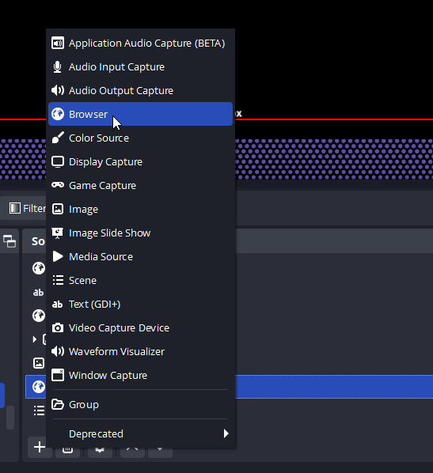
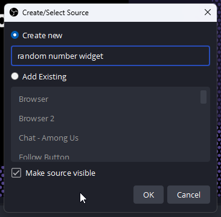
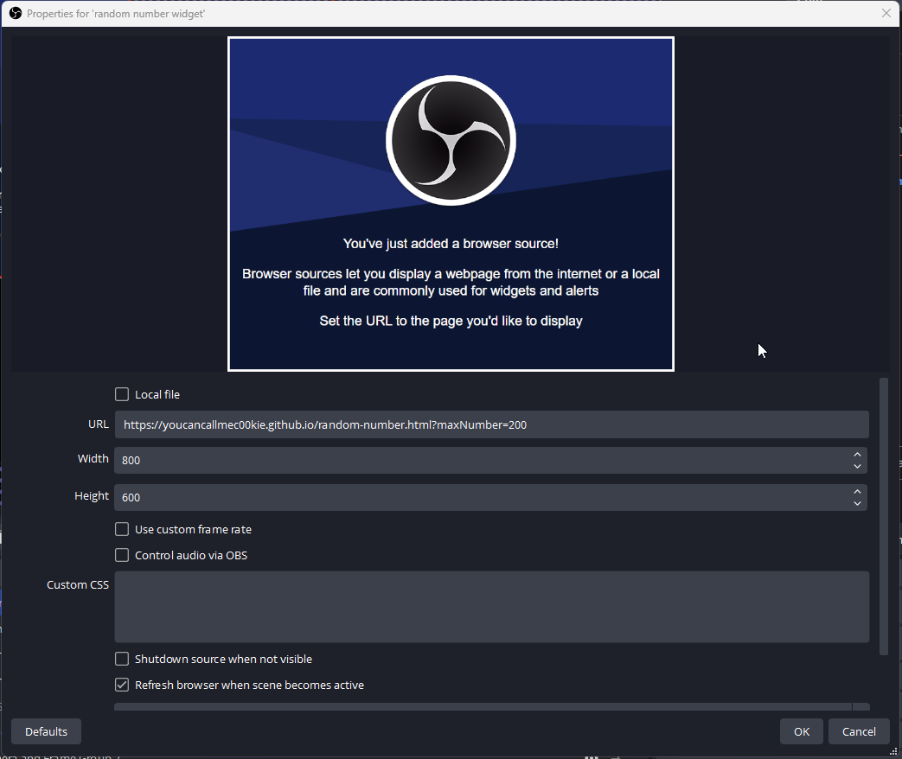
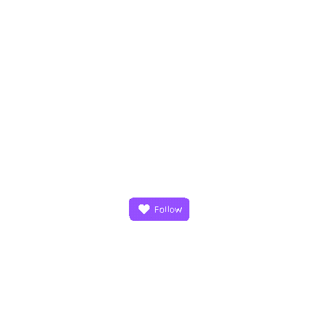
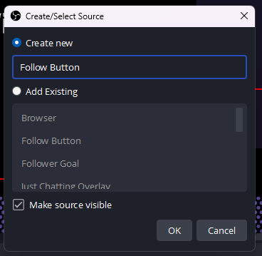
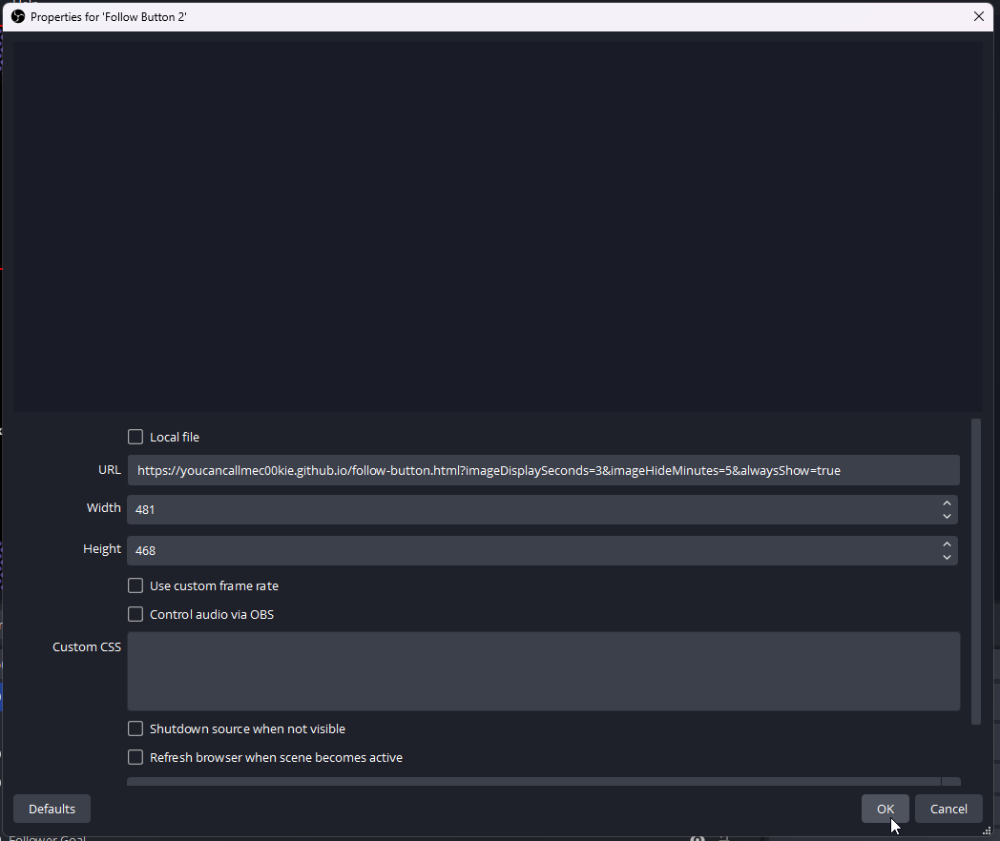

# About This Project

This project will be a collection of my own overlays/widgets/etc that I use in my own OBS setup when streaming. 

Any files here created and provided by me for free. If you wish to support me, please follow and/or subscribe to me here: [YouCanCallMeC00KIE on Twitch](https://twitch.tv/youcancallmec00kie)

The rest of the documentation will cover the various overlays and how to use them.

## Random Number

The random number widget generates a random number that can be used for raffles or various other viewer interactions.

**Adding the Widget to OBS**

Simply add the widget as a browser source, and point it to `https://youcancallmec00kie.github.io/random-number.html`. By default this will generate random numbers between 1 and 100 (inclusive). You can refresh the source in OBS to have it regenerate the number.

To customize this further, it supports the following variable added to the URL. Here is an example URL doing that `https://youcancallmec00kie.github.io/random-number.html?maxNumber=200`. This will make it so the numbers generted are now from 1 to 200 (inclusive).

- **maxNumber** - This is the max number the widget will generate. This means the number generated can be this max number.

**Detailed OBS Instruction**

Here's a bit more details on how to actually add this in OBS if you're unfamiliar.

First, just go to the sources for whichever scene you would like to add this to. Then click the **plus sign** to add a new source and choose to add a new **Browser source**. 

Then on the popup window, give your new source a name so you can identify it.

On the next popup you should blank out the **Custom CSS** property. For the **URL** you will supply the full URL to the `random-number.html` file such as `https://youcancallmec00kie.github.io/random-number.html` (to use the default options) or `https://youcancallmec00kie.github.io/random-number.html?maxNumber=200` (to supply your own options). You will likely want to check the option to **Refresh browser when scene becomes active** - depending on how you intend to use the widget.

## Follow Button

The follow button is intended as a polite nudge for viewers to follow your channel. 

**Adding the Button to OBS**

You could just add it as an image source in OBS, but doing so will mean the image will repeat every 3 seconds on a loop.

Instead, you should add the `follow-button.html` file as a browser source in OBS.

The easiest way to do this is to simply add a new browser source, and point it to `https://youcancallmec00kie.github.io/follow-button.html`. By default this will show the animation for 3 seconds (a time I've found to work well with the specific animation) and it will display ever 5 minutes.

To customize this further, you will need to add some variables to that URL. Here is an example of that `https://youcancallmec00kie.github.io/follow-button.html?imageDisplaySeconds=3&imageHideMinutes=5`. This example is the same as the default, but it specifies the options, which you can override to your liking.

- **imageDisplaySeconds** - This determines how many seconds the animation will appear for when it is shown.
- **imageHideMinutes** - This determines how many minutes the image will hide for before it appears again.
- **alwaysShow** - This is mostly for when laying out your scene. Set this to `true` so that the animation never hides. This way you can see it in OBS without waiting on timers. Set it back to `false` or remove it entirely when you're ready to go live.

**Detailed OBS Instruction**

Here's a bit more details on how to actually add this in OBS if you're unfamiliar.

First, just go to the sources for whichever scene you would like to add this to. Then click the **plus sign** to add a new source and choose to add a new **Browser source**. 

Then on the popup window, give your new source a name so you can identify it.

On the next popup, you will want to give it a **Width** of `481` and a **Height** of `468` for the specific animation that is supplied. You will also want to blank out the **Custom CSS** property. For the **URL** you will supply the full URL to the `follow-button.html` file such as `https://youcancallmec00kie.github.io/follow-button.html` (to use the default options) or `https://youcancallmec00kie.github.io/follow-button.html?imageDisplaySeconds=3&imageHideMinutes=5&alwaysShow=false` (to supply your own options).

Once configured, click OK and the button should now appear in your scene.